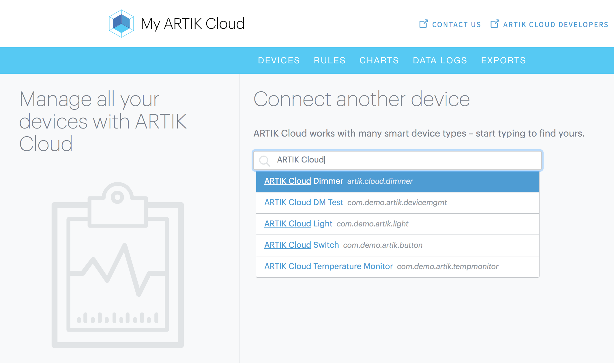
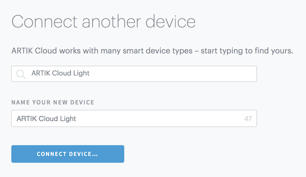
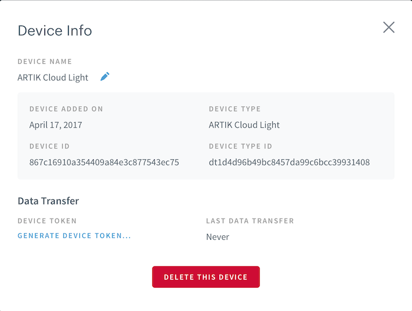

# ARTIK SDK Labs

The labs in this repository show how to build applications on ARTIK modules using the node.js [artik-sdk](https://developer.artik.io/documentation/api/index.html). 

## Prerequisites
* ARTIK Module (530 or 710)
* [ARTIK SDK](https://developer.artik.io/documentation/api/index.html)
* npm - `sudo dnf install npm`
* git - `sudo dnf install git`

## Setup / Installation:

- Clone this git repository in your module - `git clone https://github.com/SamsungARTIK/artik-sdk-lab.git`
- Change directory `cd artik-sdk-lab`
- Run `npm install` to install the node dependencies specified in `package.json` of the repository.

### Set up at ARTIK Cloud

- Follow [these instructions](https://developer.artik.cloud/documentation/tools/web-tools.html#create-an-artik-cloud-account) to sign up and create an account on ARTIK Cloud, if you haven't already created one on artik.io.

- Create devices of type:
  * ARTIK Cloud Light - com.demo.artik.light
  * ARTIK Cloud Switch - com.demo.artik.button
  * ARTIK Cloud Temperature Monitor - com.demo.artik.tempmonitor

- For each device, generate a device token:

- Make a note of the device ID and device token for each device you registered.

### Set up your .env file

- Fill the `ID`s and `TOKEN`s in the .env file with your own device IDs and device Tokens:
~~~bash
LED_DEVICE_ID=
LED_DEVICE_TOKEN=
SWITCH_DEVICE_ID=
SWITCH_DEVICE_TOKEN=
TEMP_SENSOR_DEVICE_ID=
TEMP_SENSOR_DEVICE_TOKEN=
~~~

- Save the file.

## Labs

### Lab 1 - Toggle LED every 2 seconds

In this lab, a configured LED will be toggled on/off every 2 seconds. This lab exercises the  artik-sdk's [GPIO API](https://github.com/SamsungARTIK/artik-sdk/blob/master/doc/GPIO_README.md), specifically when configured in output mode.

Run `npm run light`

### Lab 2 - Toggle LED when Button is pressed

In this lab, a configured Switch will be used to toggle on/off a LED. This lab exercises the artik-sdk's [GPIO API](https://github.com/SamsungARTIK/artik-sdk/blob/master/doc/GPIO_README.md), in both input and output modes.

Run `npm run switch`

### Lab 3 - Connect Button to ARTIK Cloud

In this lab, a configured Switch will be connected to ARTIK Cloud. This lab exercises the artik-sdk's [ARTIK Cloud connectivity](https://github.com/SamsungARTIK/artik-sdk/blob/master/doc/CLOUD_README.md), specifically using the Cloud HTTP/REST APIs.

Run `npm run cloudSwitch`

### Lab 4 - Control LEDs remotely via ARTIK Cloud

In this lab, a configured LED will be controlled using ARTIK Cloud. This lab exercises the artik-sdk's [ARTIK Cloud connectivity](https://github.com/SamsungARTIK/artik-sdk/blob/master/doc/CLOUD_README.md), specifically using the Cloud WebSocket APIs.

Run `npm run cloudLight`

### Lab 5 - Connect Temperature Sensor to ARTIK Cloud

In this lab, a temperature sensor will be connected to ARTIK Cloud. This lab exercises the artik-sdk's [Sensors API](https://github.com/SamsungARTIK/artik-sdk/blob/master/doc/SENSOR_README.md) and the artik-sdk's [ARTIK Cloud connectivity](https://github.com/SamsungARTIK/artik-sdk/blob/master/doc/CLOUD_README.md), specifically using the Cloud HTTP/REST APIs.

Run `npm run cloudTempMonitor`

More about ARTIK Cloud
---------------

If you are not familiar with ARTIK Cloud, we have extensive documentation at https://developer.artik.cloud/documentation

The full ARTIK Cloud API specification can be found at https://developer.artik.cloud/documentation/api-reference/

Peek into advanced sample applications at https://developer.artik.cloud/documentation/samples/

To create and manage your services and devices on ARTIK Cloud, visit the Developer Dashboard at https://developer.artik.cloud

License and Copyright
---------------------

Licensed under the Apache License. See [LICENSE](LICENSE).

Copyright (c) 2017 Samsung Electronics Co., Ltd.
